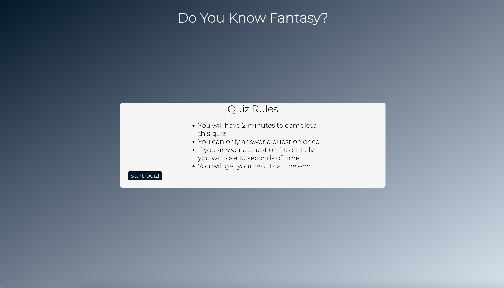
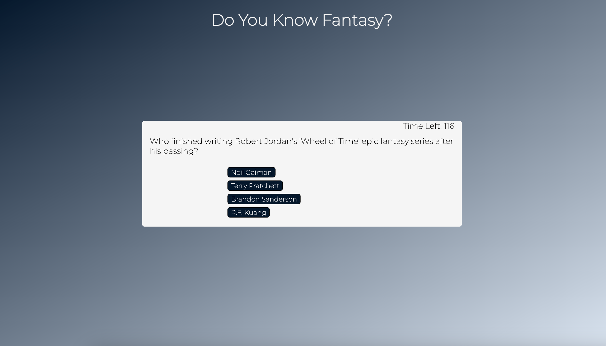
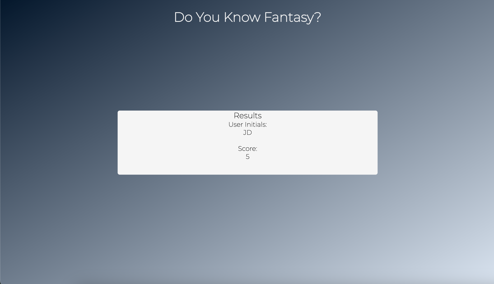

# Timed JavaScript Quiz

## Project Description

This project was built from the group up using HTML, CSS, and JavaScript, with the main functionality coming from JavaScript tools learned in class. The website has a simple, yet functional design to allow me to focus energy on new Javascript ideas. Challenges with this assignment came in the form of grasping the logic that is needed to break down what needs to happen on a website into steps that Javascript understands. I found myself very often knowing exactly what I need to do, logically, but without the knowledge on how to translate that into JavaScript.

## Resource Links

Bookish Facts: https://www.goodreads.com/

For Gradient Background: https://colordesigner.io/

Font: <i>Monserrat</i> supplied by Google Fonts

## Website Preview

 

 

## Deployed Website Link

https://nikkivno.github.io/BootcampChallenge4/

## License

MIT License

